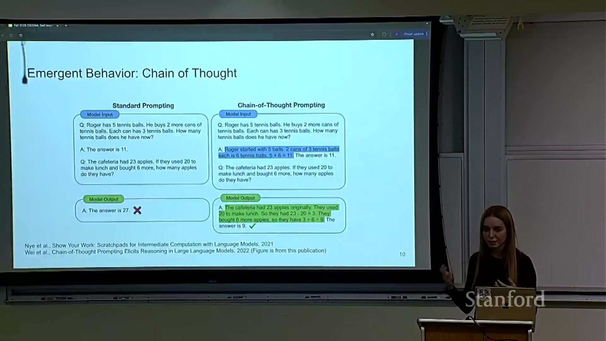
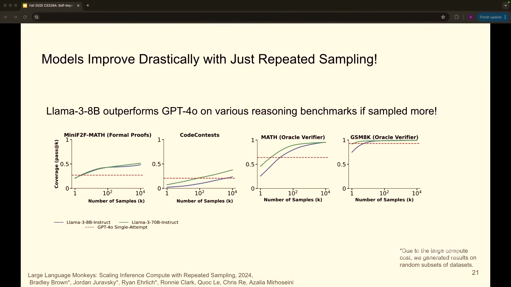
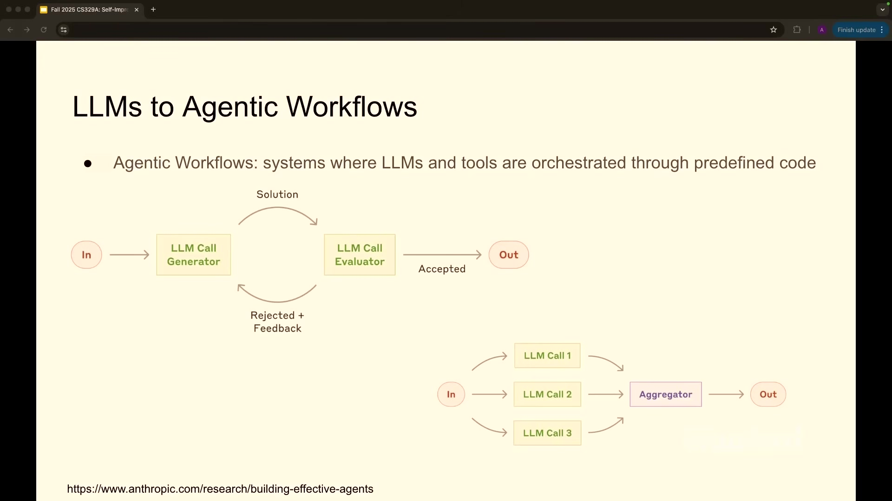

# CS329A 第 1 讲：课程概览

> 课程：Stanford CS329A — Self-Improving AI Agents（2025 年秋季）  
> 主讲：Aakanksha Chowdhery、Azalia Mirhoseini  
> [视频（约 70 分钟）](https://www.youtube.com/watch?v=6YnLB0XbTnI) · [课程官网与阅读材料](https://cs329a.stanford.edu/)  
> 本文按讲座内容归纳，不是逐字稿；时间链接可跳回视频对应位置。

## 一句话主线

大模型先通过扩大 **training compute、dataset size 和 parameter count** 获得基础能力，再经 **high-quality next-token fine-tuning**、**instruction tuning** 与 **reinforcement learning from human feedback（RLHF）** 变得易用；随后可通过 **inference-time scaling** 与 **verification** 提高解题能力。Agent 则进一步把模型置于“目标（goal）→ planning → tool use → feedback/verification → 调整或停止”的闭环里。课程研究的核心，是怎样让这个闭环更可靠，并把有效反馈用于下一轮改进。

## 1. 大模型能力从哪里来？[02:23](https://www.youtube.com/watch?v=6YnLB0XbTnI&t=143s)

- **Pre-training scaling（预训练扩展）**：讲座展示 training compute、dataset size 和 parameter count 增加时，test loss 下降的趋势。这解释了为什么更大的 base model 通常有更强的语言与任务能力；它是经验规律，并不保证所有任务都以同样幅度受益。
- **Zero-shot 与 few-shot learning**：[05:39](https://www.youtube.com/watch?v=6YnLB0XbTnI&t=339s) zero-shot 只提供任务说明，few-shot 额外提供几个输入输出示例。两者都不需要针对这个任务重新训练模型参数。
- **Chain of thought（CoT，思维链）**：[07:03](https://www.youtube.com/watch?v=6YnLB0XbTnI&t=423s) 在示例中加入中间推理步骤，可能帮助模型解决新问题。讲座的网球题是 `5 + 2 × 3 = 11`：给出“原有 5 个，两罐各 3 个”这样的步骤，比只给答案更能说明如何解同类题。讲座也指出，所展示的较小模型不一定能从 CoT prompting 中受益。这里的 **emergent behavior（涌现能力）**描述的是特定实验现象，不应理解为存在通用的参数门槛。



*读图：左侧示例只给答案，模型把新题算错；右侧示例展示推理步骤，模型据此算出新题答案。它展示的是提示方式的对照，不能单凭这一题推断所有模型、所有任务的收益。截图由 [Sparse Notes](https://sparsenotes.com/posts/2026/08/stanford-cs329a-self-improving-ai-agents/) 收录。*

## 2. 从基础模型到会遵循指令的助手 [11:20](https://www.youtube.com/watch?v=6YnLB0XbTnI&t=680s)

| 阶段 | 主要做法 | 作用 |
| --- | --- | --- |
| Pre-training（预训练） | 在大量文本等数据上预测下一个 token | 获得广泛的语言与知识能力 |
| High-quality next-token fine-tuning | 继续用筛选过的数据训练 | 改善输出质量 |
| Instruction tuning（指令微调） | 学习“instruction/question → answer”的示例，也可包含推理步骤 | 学会按请求完成任务 |
| RLHF | 收集人类对多个回答的偏好，训练 reward model，再据此优化回答 | 更贴近人类偏好，例如 helpfulness 与 safety |

讲座强调：模型在 pre-training 中学到大量统计规律，并不等于天然知道如何遵循用户意图。Post-training（后训练）的数据质量、覆盖范围以及反馈目标，都会改变实际使用体验。[14:26](https://www.youtube.com/watch?v=6YnLB0XbTnI&t=866s) [17:01](https://www.youtube.com/watch?v=6YnLB0XbTnI&t=1021s)

## 3. Inference-time scaling 与 self-improvement [19:25](https://www.youtube.com/watch?v=6YnLB0XbTnI&t=1165s)

**Inference-time scaling（也称 test-time scaling，推理时扩展）**是在模型参数固定时，投入更多生成、搜索或思考计算。讲座用 *Large Language Monkeys* 说明一种简单形式：对同一道题进行 repeated sampling（重复采样），再用 verifier（验证器）挑选候选答案。[21:01](https://www.youtube.com/watch?v=6YnLB0XbTnI&t=1261s)

```text
问题 → 固定模型生成多个 candidate → verifier 验证或排序 → 选出答案
```

实验把每题采样数从 1 提升到最多 10,000，并统计“是否至少产生过一个正确答案”；有些题在 10,000 个 candidate 里只有 3–4 个正确。这让**可靠的 verifier** 与**足够多样的 candidate** 同样重要。讲座中小模型超过 GPT-4o 单次回答的比较，针对的是这些 benchmark（基准测试）中的 coverage，不能直接解释为小模型任意一次回答都更好。[22:23](https://www.youtube.com/watch?v=6YnLB0XbTnI&t=1343s) [24:00](https://www.youtube.com/watch?v=6YnLB0XbTnI&t=1440s)



*读图：横轴是每题采样次数 `k`（log scale），纵轴是 coverage／pass@k；红色虚线是 GPT-4o single attempt 的 baseline。图中不同 benchmark 的曲线不能混为一个整体成绩；部分图使用 oracle verifier，且截图注明因计算成本只在随机子集上生成结果。来源：[讲座截图](https://sparsenotes.com/posts/2026/08/stanford-cs329a-self-improving-ai-agents/)。*

- 数学答案、代码 unit tests 等提供相对明确的 verification signal。开放式写作等任务较难建立可靠 verifier，可能需要 human feedback 或 LLM-as-judge。[26:43](https://www.youtube.com/watch?v=6YnLB0XbTnI&t=1603s)
- **Coverage／pass@k** 问“k 个 candidate 中是否至少一个正确”；**pass@1** 问“一次输出是否正确”。讲座的 repeated sampling 实验主要展示前者；若无法识别正确 candidate，coverage 高也不等于用户会收到正确答案。[22:23](https://www.youtube.com/watch?v=6YnLB0XbTnI&t=1343s) [36:37](https://www.youtube.com/watch?v=6YnLB0XbTnI&t=2197s)
- Compute cost 会随采样增加；parallel sampling 可缓解部分 latency，但不能消除算力成本。采样多样性也需控制，temperature 过高会降低答案质量。[26:18](https://www.youtube.com/watch?v=6YnLB0XbTnI&t=1578s)
- **Self-improvement loop（自我改进闭环）**：用模型产生 candidate，用可靠反馈筛出高质量 reasoning trace 或代码，再把这些结果作为 synthetic training data，改善之后的一次输出能力。这是讲座从 inference-time scaling 过渡到 self-improvement 的关键。[28:28](https://www.youtube.com/watch?v=6YnLB0XbTnI&t=1708s)

Reasoning model 还会进行 problem analysis、task decomposition、尝试方案、读取反馈、backtracking 与 self-correction。课程把这些能力与训练、test-time search 和 reward signal 联系起来；其确切贡献机制仍有研究空间。[31:22](https://www.youtube.com/watch?v=6YnLB0XbTnI&t=1882s) [51:20](https://www.youtube.com/watch?v=6YnLB0XbTnI&t=3080s)

## 4. 从聊天模型到 Agent [40:58](https://www.youtube.com/watch?v=6YnLB0XbTnI&t=2458s)

讲座给出的实用定义是：Agent 接收一个 **goal**，进行 planning 并与 environment 交互，依据 feedback 调整 action，最后判断 stopping condition 是否满足，或报告无法完成。[42:20](https://www.youtube.com/watch?v=6YnLB0XbTnI&t=2540s)

```text
理解 goal → planning → tool use 并观察结果 → verification → 修正/继续 → 停止
```

课程区分两种实现形态：

| 形态 | 特点 | 例子 |
| --- | --- | --- |
| 预先设计的 agentic workflow | 人设计步骤与分支，模型在各节点执行任务 | prompt chaining、routing、parallelization 与 aggregation |
| 更开放的 Agent loop | 模型依据 environment feedback 动态决定下一步 | coding agent 搜索仓库、修改文件、运行测试、再修改 |



*读图：上图是 generator 提出候选、evaluator 接受或退回并给 feedback；下图是多个 LLM calls 并行完成子任务，再由 aggregator 合并。两者都是**预先编排的 agentic workflow**，不等同于模型能在任意环境里自主完成开放任务。截图由 [Sparse Notes](https://sparsenotes.com/posts/2026/08/stanford-cs329a-self-improving-ai-agents/) 收录。*

常见组件包括 tool calls、context 或 memory、orchestrator、LLM-as-judge／evaluator 与 verifier。**Evaluator** 可用模型判断答案质量；**verifier** 则尽可能利用可检查的外部结果，例如运行代码和 unit tests。能否获得可靠 feedback，是系统继续改进的关键瓶颈。[44:50](https://www.youtube.com/watch?v=6YnLB0XbTnI&t=2690s) [47:11](https://www.youtube.com/watch?v=6YnLB0XbTnI&t=2831s) [50:34](https://www.youtube.com/watch?v=6YnLB0XbTnI&t=3034s)

**Coding agent 的具体循环**：理解任务并定位 repository 文件 → 查看与编辑代码 → 执行命令或 tests → 读取输出 → 决定下一次修改。它还需判断 user intent 是否明确，以及测试结果能否证明任务完成。[48:04](https://www.youtube.com/watch?v=6YnLB0XbTnI&t=2884s) [52:39](https://www.youtube.com/watch?v=6YnLB0XbTnI&t=3159s)

**其他讲座案例**：research agent 搜集资料、拟定提纲并综合报告；客户支持系统完成 transcription、knowledge assist 与 smart reply；AI scientist 辅助 idea generation、experiment iteration 和 paper writing。这些案例展示了可用方向，不代表所有环节都已能稳定全自动完成。[54:34](https://www.youtube.com/watch?v=6YnLB0XbTnI&t=3274s) [55:49](https://www.youtube.com/watch?v=6YnLB0XbTnI&t=3349s)

### 为什么 verification 会成为瓶颈？[50:34](https://www.youtube.com/watch?v=6YnLB0XbTnI&t=3034s)

Generator 可以产生大量看似合理的答案，难处在于 verifier 能否判断哪个真正有用。数学、代码等任务常有可执行或规则明确的 feedback；创意写作等 open-ended tasks 则更依赖昂贵的 human feedback。讲座将这种 **generator–verifier gap（生成与验证之间的落差）**视为 self-improvement 的重要限制，课程后续会专门讨论 verifiers。[26:43](https://www.youtube.com/watch?v=6YnLB0XbTnI&t=1603s) [50:34](https://www.youtube.com/watch?v=6YnLB0XbTnI&t=3034s)

课堂问答还提出两个待研究的问题：模型似乎更容易利用自己生成的 reasoning traces，但不能据此断定所有任务中 self-generated traces 都优于强模型提供的轨迹；reasoning 能力的提升究竟来自 pre-training data、reinforcement learning（RL），还是两者的组合，讲师明确表示目前没有单一共识。[38:04](https://www.youtube.com/watch?v=6YnLB0XbTnI&t=2284s) [51:51](https://www.youtube.com/watch?v=6YnLB0XbTnI&t=3111s)

## 5. 课程路线与项目 [01:00:32](https://www.youtube.com/watch?v=6YnLB0XbTnI&t=3632s)

课程官网把后续内容组织为：test-time compute scaling、robust verification、learning from tool/code feedback、multi-step reasoning 与 planning、train-time RL scaling、open-ended evolution、search 与 deep research、software engineering agents、memory、long-horizon evaluation 和 robotics 中的 multimodal agents。学习形式包括论文阅读、作业和原创研究项目。

2025 年秋季开课安排包含 **3 次作业与 1 个 research project（研究项目）**；官网给出的总评比例为作业 50%，项目各阶段合计 50%。讲座建议 2–4 人组队，并提到会提供 API credits。项目鼓励提出可检验的研究问题，例如新 benchmark、agent reliability evaluation，或对已有方法的改进；单纯拼装应用或 survey paper 不符合讲座描述的研究目标。官网列出的日期与政策属于 **2025 年秋季学期**，以后修读应以当期课程页面为准。[01:02:17](https://www.youtube.com/watch?v=6YnLB0XbTnI&t=3737s) [01:03:13](https://www.youtube.com/watch?v=6YnLB0XbTnI&t=3793s) [课程官网](https://cs329a.stanford.edu/)

## 复习时回答这 4 个问题

1. 为什么 parameter count 之外，还要讨论 dataset size、training compute 和 post-training？
2. pass@k 提升为什么不能直接证明用户拿到的单个答案也更好？
3. 哪些任务能提供可靠 verification signal？验证困难时系统会遇到什么瓶颈？
4. 一个完成 end-to-end task 的 Agent，需要哪些状态（state）、tools、feedback 和 stopping condition？

## 资料与核对

- [原始讲座视频](https://www.youtube.com/watch?v=6YnLB0XbTnI)
- [Stanford CS329A 课程官网（2025 年秋季）](https://cs329a.stanford.edu/)
- [带时间戳的公开视频字幕索引](https://ainotes.us/summary/550)：用于定位讲座内容；自动字幕可能有识别错误。课程名、讲师、安排及评分以官网为准。
- [Sparse Notes 的第一讲阅读笔记](https://sparsenotes.com/posts/2026/08/stanford-cs329a-self-improving-ai-agents/)：提供了值得进一步展开的案例与问答线索；本文相关补充已对照字幕。该文末尾写作“Fall 2026”，与课程官网列出的 2025 年秋季不一致，学期信息以官网为准。
