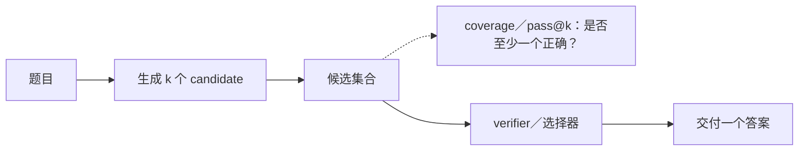
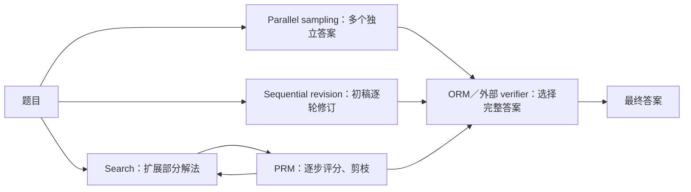

# CS329A 第 2 讲：Test-Time Compute Scaling

> 课程：Stanford CS329A — Self-Improving AI Agents（2025 年秋季）
>
> 主讲：Azalia Mirhoseini；上课日期：2025 年 9 月 26 日
>
> [原视频（1:03:20）](https://www.youtube.com/watch?v=-Ggc37xLj_Y) · [课程官网及指定阅读](https://cs329a.stanford.edu/)
>
> 本文是根据讲座英文转录、视频片段和相关论文整理的归纳笔记，不是逐字稿。时间链接均指向这段视频；转录个别问答听不清，相关细节不据此下结论。

## 一句话主线

**这讲最反直觉的结果**：单次表现明显较弱的小型开放模型，可以靠大量生成、搜索和验证，在多个 benchmark 上超过当时更强模型的**单次尝试**。这里的 **scaling** 很直观：模型不变，把每题的尝试次数 `k` 从 1 增大，至少找到一个正确答案的机会（coverage）通常随之提高。随后才是更难的系统问题：能否从候选中认出它、花多少计算最合算？讲座还比较了把计算花在 **training time**（训练更强的 base model）与 **test time**（让现有模型多尝试）上的收益：两者在一些题目上可以替代，但最难的题往往更需要提升 base model。[02:01](https://www.youtube.com/watch?v=-Ggc37xLj_Y&t=121s) [38:02](https://www.youtube.com/watch?v=-Ggc37xLj_Y&t=2282s)

## 1. Repeated sampling：先理解 coverage [01:24](https://www.youtube.com/watch?v=-Ggc37xLj_Y&t=84s)

最简单的 test-time scaling 是让同一模型对同一道题独立生成 `k` 个 candidate，再尝试选出正确的一个。模型权重没有改变；额外成本发生在每次推理。讲座用 *Large Language Monkeys* 的数学、编程和 SWE-bench 例子说明：即使模型单次成功率较低，增加采样也可能让正确答案出现在候选集中。[03:13](https://www.youtube.com/watch?v=-Ggc37xLj_Y&t=193s)

**小模型超过强模型，具体是怎样比较的？** 论文展示 Llama-3-8B-Instruct 等单次表现弱于 GPT-4o 的模型，增加采样后，在多个数学、代码和形式化证明任务上的 **coverage** 超过 GPT-4o 的**单次成绩**。SWE-bench Lite 的例子更具体：DeepSeek-Coder-V2-Instruct 单次解决率为 15.9%，250 次采样的 coverage 达 56%，超过当时 43% 的单次 state of the art（SOTA）基线。模型可能更小、也可能在单次能力上落后；关键并非「小模型每次回答都更聪明」，而是把较弱但非零的单次成功概率，放大为多次尝试至少成功一次的概率。这里的 56% 仍要结合测试能否可靠识别有效补丁理解。[02:01](https://www.youtube.com/watch?v=-Ggc37xLj_Y&t=121s) [03:36](https://www.youtube.com/watch?v=-Ggc37xLj_Y&t=216s) [*Large Language Monkeys* 论文 §2](https://arxiv.org/html/2407.21787v3)

在固定模型、固定题目和可独立重采样的前提下，增加 `k` 不会降低「候选中至少一个正确」的概率；这正是「生成的量越大，结果越好」成立的**直接含义**。但收益逐渐变小，模型完全解不出的题不会因采样而突然可解，有限预算还要考虑 verifier 和调用成本。因此，不能把这句话直接套到最终交付的单个答案上。[07:33](https://www.youtube.com/watch?v=-Ggc37xLj_Y&t=453s) [15:34](https://www.youtube.com/watch?v=-Ggc37xLj_Y&t=934s)

| 指标 | 问的问题 | 必须注意 |
| --- | --- | --- |
| `pass@1` | 单次采样是否正确？ | 衡量原模型一次尝试的能力；对完整系统也可衡量最终单个输出的正确率。 |
| `coverage`／`pass@k` | `k` 次采样中是否至少有一次正确？ | 是候选集合的上界指标；只有可靠选择器才能把它转化为交付质量。 |
| 系统成功率 | 实际选择并返回的答案是否正确？ | 还受 verifier、融合器、测试质量和成本约束。 |

若一道题单次成功概率为 `p_i`，并暂且假定各次采样独立，则其 `pass@k = 1 − (1 − p_i)^k`。这是**单题**的指数式失败概率下降。跨一组题目求平均时，讲座展示的 coverage 曲线却常可由论文的 *exponentiated power law* `c ≈ exp(a k^b)` 拟合；原因是题目难度分布中有一条「单次成功概率极低，但并非零」的长尾。这个拟合描述特定模型与任务分布的经验现象，不保证所有 benchmark 都遵循同一曲线。[05:15](https://www.youtube.com/watch?v=-Ggc37xLj_Y&t=315s) [07:33](https://www.youtube.com/watch?v=-Ggc37xLj_Y&t=453s) [*Large Language Monkeys* 论文 §3.1](https://arxiv.org/html/2407.21787v3)

对 SWE-bench 等 coding tasks，测试可以帮助自动选择补丁，因此 coverage 更有机会转成实际成功率。但「通过现有测试」不一定等于修复完整：测试可能覆盖不足或不稳定。*Large Language Monkeys* 论文报告了 SWE-bench Lite 的 flaky tests，也讨论了其他代码测试的误判；讲座在课堂问答中同样提醒 verifier 的质量决定结论能否成立。[12:20](https://www.youtube.com/watch?v=-Ggc37xLj_Y&t=740s) [26:00](https://www.youtube.com/watch?v=-Ggc37xLj_Y&t=1560s) [论文 §4.2](https://arxiv.org/html/2407.21787v3)

## 2. Generation–verification gap：找到答案之后怎样认出它？[15:34](https://www.youtube.com/watch?v=-Ggc37xLj_Y&t=934s)

讲座把 **oracle verifier** 想象成总能从候选里认出正确答案的理想选择器。它的成绩对应 coverage 上界。实际可用的方法，例如 **majority voting**（选出现次数最多的最终答案）或训练过的 **reward model**（给完整回答打分），在展示的 GSM8K、MATH 实验里会早于 coverage 进入平台期。困难题的正确答案可能在上千次生成中只出现一两次，因此多数投票尤其容易错过它。这段差距就是 **generation–verification gap**。[16:08](https://www.youtube.com/watch?v=-Ggc37xLj_Y&t=968s) [18:09](https://www.youtube.com/watch?v=-Ggc37xLj_Y&t=1089s)

| 验证信号 | 讲座例子 | 边界 |
| --- | --- | --- |
| Formal proof checker | 检查形式化证明的步骤 | 需要可形式化的任务和证明。 |
| Executable tests | 运行程序或软件补丁的 unit tests | 测试可能缺失、flaky 或误判。 |
| 输出对照 | 比较生成的 CUDA kernel 与 PyTorch 参考实现 | 有限输入上的相同输出只是测试证据，不能自动证明所有输入等价。 |
| Model-based judge／reward model | 给完整候选或中间步骤评分、排序 | 分数是 learned signal，并非可执行的正确性证明；跨任务泛化也受限制。 |

课堂讨论提出了生成更多测试、用 simulation 筛掉错误候选、组合多个 verifier 等研究方向；这些是**讨论中的设想**，讲座没有证明它们能普遍消除这个 gap。[23:31](https://www.youtube.com/watch?v=-Ggc37xLj_Y&t=1411s) [24:49](https://www.youtube.com/watch?v=-Ggc37xLj_Y&t=1489s)

## 3. 候选怎样生成、结果怎样评分：两个不同问题 [26:55](https://www.youtube.com/watch?v=-Ggc37xLj_Y&t=1615s)

这里容易把两种选择混在一起，实际上它们回答不同问题：**parallel sampling 与 sequential revision 是生成／计算预算的分配方式；ORM 与 PRM 是 learned verification／scoring 的粒度。** 可以组合使用，不是一组四选一的方法。[论文 §2–3](https://arxiv.org/html/2408.03314v1)

| 选择轴 | 方法 | 作用 |
| --- | --- | --- |
| **生成候选／分配预算** | **Parallel sampling**；**sequential revision** | 前者同时探索多个独立解法；后者持续修改已有解法。也可先开多条分支，再逐条修订。 |
| **评估候选／指导搜索** | **Outcome reward model（ORM）**；**process reward model（PRM）** | ORM 给完整答案评分；PRM 给中间推理步骤评分。两者都是训练出的评分器，而非直接执行程序的 verifier。 |

ORM 常用在 `best-of-N`，从大量完整输出中挑分数最高的一个；也能在连续修订得到的多个完整版本中做最终选择。PRM 不必等到生成大量**完整**答案：它可以在 **beam search** 的每一步给部分路径打分、剪枝，再把计算花在较有希望的分支上。PRM 的「步骤」是有意义的推理片段，并不必然等于每个 token。两种模型的分数都有误差，不能当作 oracle verification。[28:35](https://www.youtube.com/watch?v=-Ggc37xLj_Y&t=1715s) [30:20](https://www.youtube.com/watch?v=-Ggc37xLj_Y&t=1820s) [32:19](https://www.youtube.com/watch?v=-Ggc37xLj_Y&t=1939s) [论文 §2–3](https://arxiv.org/html/2408.03314v1)

在**生成策略**这个轴上，*Scaling LLM Test-Time Compute Optimally* 比较不同预算分配：parallel sampling 同时探索多个独立解法；sequential revision 则让已有解法继续推演、反思或修改。讲座指出，此处的顺序修订可通过 prompting 实现；它不等于在当前推理过程中训练了模型参数。[27:20](https://www.youtube.com/watch?v=-Ggc37xLj_Y&t=1640s) [28:12](https://www.youtube.com/watch?v=-Ggc37xLj_Y&t=1692s)

论文按 base model 对各题的 `pass@1` 把题目分难度组，比较相同生成预算下的策略。讲座展示：对较容易的题，更多 sequential compute 往往有效；对最难的一组，最佳 parallel/sequential 比例没有简单、稳定的单一规则。论文的 *compute-optimal* 策略意在按题目与预算选择方法，论文摘要报告相对于 `best-of-N` 的效率提升超过 4 倍；这属于该论文的实验设置，不是所有任务都可复现的固定倍率。[34:40](https://www.youtube.com/watch?v=-Ggc37xLj_Y&t=2080s) [37:00](https://www.youtube.com/watch?v=-Ggc37xLj_Y&t=2220s) [论文](https://arxiv.org/abs/2408.03314)

### Training-time 与 test-time scaling 能否互换？[37:57](https://www.youtube.com/watch?v=-Ggc37xLj_Y&t=2277s)

这是本讲明确讨论的问题。论文做 **FLOPs-matched comparison**：一边预训练参数量约为原来 14 倍的较大模型、用较少 test-time compute；另一边保留较小模型，把相当的计算预算用于 test-time revision 或 search。结果取决于题目难度，以及未来要处理多少 inference 请求：[论文 Figure 9 与 §7](https://arxiv.org/html/2408.03314v1)

| 情况 | 论文和讲座中的倾向 |
| --- | --- |
| 容易或中等难度；较小模型已有一定解题概率 | 增加 test-time compute 常比继续扩大预训练更有效。 |
| 最难的题；现有模型几乎找不到正确解 | 单纯追加采样或修订收益很小，提升 base model 的 pre-training compute 更有效。 |
| 未来 inference 量很大 | 训练较大模型的一次性成本可在大量请求间分摊；每次请求都多采样的累计成本会增加。 |

因此，「两种 compute 可以互换」是**预算内的经验性 trade-off**，不是一比一的兑换率。论文还指出某些困难题在特定训练／推理负载下仍可能受益于 test-time compute，不能按难度给出无条件规则。讲座中的口头结论更强调：对**最难的问题**，更强的 base model 仍有不可轻易由大量生成弥补的优势。[38:02](https://www.youtube.com/watch?v=-Ggc37xLj_Y&t=2282s) [39:22](https://www.youtube.com/watch?v=-Ggc37xLj_Y&t=2362s) [论文 §7](https://arxiv.org/html/2408.03314v1)

## 4. Archon：把推理流程本身作为搜索对象 [45:19](https://www.youtube.com/watch?v=-Ggc37xLj_Y&t=2719s)

前面的问题是如何在固定预算中选策略；**Archon** 更进一步，把推理流程建成可搜索的 architecture。输入包括目标 benchmark、允许的 inference budget、可用模型和操作集合；搜索器尝试组合这些操作，优化 **accuracy–cost** 的权衡。论文允许针对单一任务或多个任务找架构，因此结果依赖所选 benchmark 和预算。[46:43](https://www.youtube.com/watch?v=-Ggc37xLj_Y&t=2803s) [47:03](https://www.youtube.com/watch?v=-Ggc37xLj_Y&t=2823s) [*Archon* 论文](https://arxiv.org/abs/2409.15254)

| 操作 | 在讲座中的作用 |
| --- | --- |
| Generation | 用一个或多个模型生成 candidate。 |
| Critic | 指出 candidate 的优点、弱点。 |
| Ranker | 对已有 candidate 排序。 |
| Fusion | 读取多个 candidate，综合生成**新的**单个答案。 |
| Unit test generation／evaluation | 为代码任务提出测试，再用测试或模型评估候选。 |

Fusion 与 oracle selection 的比较尤其容易误读。讲座展示的某项 benchmark 实验中，fusion 的结果高于「从原有候选中选最好一个」：它可以**产生新答案**，因此并不受原始候选的 coverage 上界约束。这并不说明 fusion 总比完美验证器可靠，也不能把图中的现象推广到所有任务。[48:41](https://www.youtube.com/watch?v=-Ggc37xLj_Y&t=2921s) [51:31](https://www.youtube.com/watch?v=-Ggc37xLj_Y&t=3091s) [52:41](https://www.youtube.com/watch?v=-Ggc37xLj_Y&t=3161s)

讲座介绍的搜索空间会加入结构约束，例如第一层先 generation，unit test generator 后接 evaluator，再用 Bayesian optimization 减少要试验的配置数。多层 critic、ranker、fusion 在展示的 benchmark 中优于较浅组合，但层数增加也带来更多调用与延迟。系统最后只交付一个答案，所以这里关心的是**完整推理架构的最终 `pass@1`**，而不是采样池中曾出现正确答案的 `pass@k`。[56:20](https://www.youtube.com/watch?v=-Ggc37xLj_Y&t=3380s) [59:40](https://www.youtube.com/watch?v=-Ggc37xLj_Y&t=3580s) [01:01:22](https://www.youtube.com/watch?v=-Ggc37xLj_Y&t=3682s)

**数值核对**：讲座末尾口述 Archon 对当时 frontier baselines 的平均提升为 **14.1%**；目前课程链接所指向的 arXiv v6 摘要写 **15.1%**，比较对象还包括 o1。两者版本或汇总口径可能不同；在没有把对应表格、版本与度量逐项对齐前，不把其中任一数字写成跨版本的统一结论。这里可靠的课堂结论是：论文报告，在其 instruction-following、reasoning 和 coding 评测及预算条件下，搜索出的架构改善了最终单个输出的成绩。[01:01:22](https://www.youtube.com/watch?v=-Ggc37xLj_Y&t=3682s) [01:02:44](https://www.youtube.com/watch?v=-Ggc37xLj_Y&t=3764s) [arXiv v6 摘要](https://arxiv.org/abs/2409.15254)

## 5. 本讲留下的系统问题

1. **可验证性**：开放式任务里，怎样建立比 majority voting 或单一 model-based judge 更可靠的 feedback？
2. **预算分配**：什么题需要更多 parallel exploration，什么题值得持续 revision，何时应停止？
3. **成本口径**：同一准确率下，要一起衡量生成 token、调用次数、latency、测试成本，以及模型训练的一次性成本。
4. **泛化**：针对某一 benchmark 搜出的策略，换任务、换模型、换测试条件后还能保持收益吗？

## 复习时回答这 4 个问题

1. 为什么单题 `pass@k` 的公式与跨题数据集的经验 scaling curve 并不矛盾？
2. 正确答案只在 1,000 个 candidate 中出现一次时，majority voting 会怎样？oracle coverage 又意味着什么？
3. ORM 与 PRM 分别给什么对象打分？PRM 如何改变搜索树的扩展？
4. Archon 的 fusion 为什么可能超过原始候选的 oracle selection？这能推出什么，不能推出什么？

## 资料与核对

- [Stanford Online 原视频](https://www.youtube.com/watch?v=-Ggc37xLj_Y)：视频 ID `-Ggc37xLj_Y`；本文时间戳依据该视频的英文时间戳转录定位，并核对了视频页面。转录标记为「authored or unspecified」，个别课堂问答存在识别缺口。
- [Stanford CS329A 官网：2025 年秋季第 2 讲与指定论文](https://cs329a.stanford.edu/)：用于核对讲次、日期、主题及阅读材料。
- [Brown et al., *Large Language Monkeys*](https://arxiv.org/html/2407.21787v3)：核对 coverage 拟合、验证落差和测试局限。
- [Schaeffer et al., *How Do Large Language Monkeys Get Their Power (Laws)?*](https://arxiv.org/abs/2502.17578)：核对单题概率与跨题长尾分布的解释。
- [Snell et al., *Scaling LLM Test-Time Compute Optimally*](https://arxiv.org/abs/2408.03314)：核对预算分配和难度条件。
- [Saad-Falcon et al., *Archon*](https://arxiv.org/abs/2409.15254)：核对架构搜索目标和论文版本中的数值。
