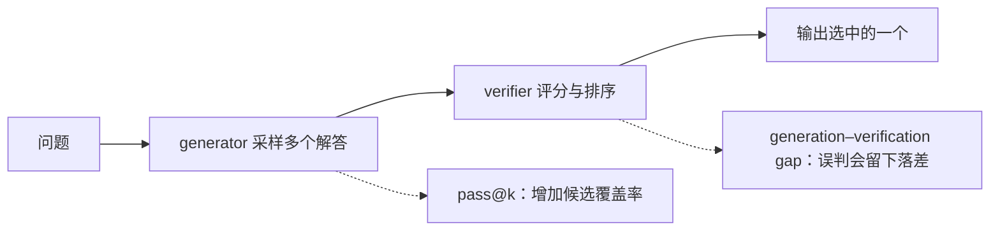
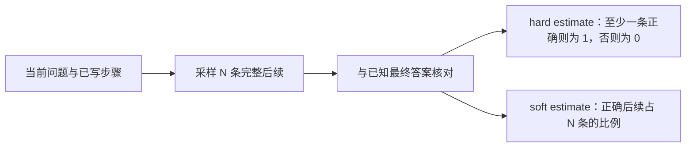

# CS329A 第 3 讲：Robust Verification

> 课程：Stanford CS329A — Self-Improving AI Agents（2025 年秋季） 
> 主讲：Azalia Mirhoseini（2025 年 9 月 29 日课堂；视频由 Stanford Online 于 2026 年发布） 
> [原视频（约 72 分钟）](https://www.youtube.com/watch?v=p7TdPUcPoik) · [课程官网与本讲阅读材料](https://cs329a.stanford.edu/) 
> 本文按讲座归纳，不是逐字稿。时间链接来自发布者提供的英文 CC；已对照论文核实关键机制，但未逐帧核对视频音频与幻灯片，听辨不清的课堂问答不作确定转述。

## 一句话主线

Repeated sampling 可以让正确解出现在候选集合中，却不能保证系统能把它挑出来。Robust verification 要解决的是这个 **generation–verification gap（生成—验证落差）**：先学习给完整解答打分的 verifier，继而监督每一步的 process reward model（PRM），再用自动 rollout 代替昂贵的人类逐步标注，最后通过多个有误差的 verifier 组成更强的选择器。这里既有**推理时选答案**，也有把 verifier 当作 reward 改进生成模型的**训练时循环**，两者不能混为一谈。[00:05](https://www.youtube.com/watch?v=p7TdPUcPoik&t=5s) [01:06:29](https://www.youtube.com/watch?v=p7TdPUcPoik&t=3989s)

## 1. 为什么仅仅生成更多答案还不够？[00:14](https://www.youtube.com/watch?v=p7TdPUcPoik&t=14s)

给定问题 `q`，generator 产生 `k` 个候选 `s₁ … sₖ`。**Coverage／pass@k** 问的是“其中是否至少有一个正确”；实际系统的 **selected-answer accuracy** 问的是“verifier 排序后输出的那一个是否正确”。前者随候选增加通常有上升空间，后者却可能因 verifier 误判而停滞甚至下降。Oracle selector 假定总能认出正确候选，只是上界，不是可部署的 verifier。讲师回顾上一讲的 majority voting（按最终答案出现频率投票）：它不需要训练 verifier，但候选继续增加时也可能无法跟上 coverage。[14:40](https://www.youtube.com/watch?v=p7TdPUcPoik&t=880s) [01:00:30](https://www.youtube.com/watch?v=p7TdPUcPoik&t=3630s)

本讲的四篇论文不是同一套模型、数据和算力预算下的统一排行榜；它们依次改变了**反馈粒度、标签来源和验证计算分配方式**。

| 方法 | 主要评分对象 | 标签／信号来源 | 推理时怎么用 | 主要代价或风险 |
| --- | --- | --- | --- | --- |
| [Cobbe et al., 2021](https://arxiv.org/abs/2110.14168) | 整条数学解答 | 已知最终答案对生成解答作对错标注 | best-of-`k` | 错误过程可能碰巧得出正确答案；排序器会误判 |
| [Lightman et al., 2023](https://arxiv.org/abs/2305.20050) | 每个推理步骤 | 人工逐步标注 | 汇总 step scores 后选择 | 人工标注昂贵，步骤定义与评分策略影响结果 |
| [Math-Shepherd](https://arxiv.org/abs/2312.08935) | 每个步骤到正确终点的潜力 | 从该步骤继续采样，以最终答案自动标注 | PRM 排序；还可作 RL reward | 需要可检查的最终答案和额外 rollout；潜力不等于步骤正确 |
| [Weaver](https://arxiv.org/abs/2506.18203) | 完整候选的多路 verifier 分数 | 多个 reward model／LLM judge，辅以少量标签作筛选 | 标准化、估计可靠性、加权选择 | verifier 相关错误、低质成员和推理成本 |

## 2. 从 GSM8K 到训练完整解答的 verifier [01:15](https://www.youtube.com/watch?v=p7TdPUcPoik&t=75s)

《[Training Verifiers to Solve Math Word Problems](https://arxiv.org/abs/2110.14168)》同时引入 **GSM8K（Grade School Math 8K）**：约 8,500 道需要多步自然语言推理的小学数学应用题。它提供已知的最终答案，因此能给模型生成的解答自动贴“最终答案对／错”的二元标签；这与请人类逐步审查推理不是同一种监督。[01:50](https://www.youtube.com/watch?v=p7TdPUcPoik&t=110s) [03:48](https://www.youtube.com/watch?v=p7TdPUcPoik&t=228s)

训练流程是先 fine-tune generator，再对每题采样约 100 条 completion，将结果与 ground truth 比较以建立 verifier 训练集。论文的 verifier 是带额外标量预测头的语言模型，结合 correctness prediction 与 language-modeling loss；可在 token／句子位置预测，但用于整条解答排序的是**末尾的预测分数**。测试时重新采样多个候选，由 verifier 选出最高分者。讲座明确区分了人写一次标准答案与模型多次采样、自动标注的两个环节。[04:02](https://www.youtube.com/watch?v=p7TdPUcPoik&t=242s) [05:28](https://www.youtube.com/watch?v=p7TdPUcPoik&t=328s) [08:25](https://www.youtube.com/watch?v=p7TdPUcPoik&t=505s) [16:23](https://www.youtube.com/watch?v=p7TdPUcPoik&t=983s)

对照实验显示，在该实验设置中，verifier 有足够训练数据时，generate-and-rank 相比只做 generator 的 supervised fine-tuning 更有利；标签少时优势并不稳定。另一项消融显示“大 generator＋小 verifier”好于相反配置，但讲师把最佳规模比例留作研究问题，不能外推为所有模型的定律。[11:02](https://www.youtube.com/watch?v=p7TdPUcPoik&t=662s) [12:55](https://www.youtube.com/watch?v=p7TdPUcPoik&t=775s)

讲座展示的 selected-answer accuracy 在候选数约 400 附近收益趋缓，更多样本时可能回落；原因是最大 verifier 分数不一定属于真正正确的候选，**这不是 pass@k 本身下降**。讲师说实际系统选用约 100 次采样以权衡稳定性与收益，两个数字对应不同的问题。[14:25](https://www.youtube.com/watch?v=p7TdPUcPoik&t=865s) [17:18](https://www.youtube.com/watch?v=p7TdPUcPoik&t=1038s)

## 3. Outcome supervision 与 process supervision [21:10](https://www.youtube.com/watch?v=p7TdPUcPoik&t=1270s)

《[Let's Verify Step by Step](https://arxiv.org/abs/2305.20050)》把比较转向更难的 **MATH** 题。**Outcome reward model（ORM）** 对完成的解答给分；**process reward model（PRM）** 看问题和前文，逐步判断下一步是否可接受。ORM 的最终答案标签较容易取得，却可能奖励“中间推导错误、最后碰巧答对”的解答；PRM 给 credit assignment（贡献归因）提供更局部的信号，但需要大量逐步反馈。[21:57](https://www.youtube.com/watch?v=p7TdPUcPoik&t=1317s) [23:08](https://www.youtube.com/watch?v=p7TdPUcPoik&t=1388s) [25:02](https://www.youtube.com/watch?v=p7TdPUcPoik&t=1502s)

论文收集的 **PRM800K** 是约 80 万条**人类给出的 step-level feedback 标签**，不是 80 万道独立数学题。讲座用分数题说明：前面列式可以正确，最后一次算术失误仍应标为错误。为提高标注效率，研究者优先挑选可能揭示“看似可信却有错”的样本进行 active learning；讲座报告相对随机挑选约 **2.6 倍**的数据效率收益，这是特定标注策略与实验设置的比较。[26:00](https://www.youtube.com/watch?v=p7TdPUcPoik&t=1560s) [27:08](https://www.youtube.com/watch?v=p7TdPUcPoik&t=1628s) [28:01](https://www.youtube.com/watch?v=p7TdPUcPoik&t=1681s)

本实验中，ORM 用完成时的分数，PRM 可将各步骤的正确概率**相乘**形成整条解答的分数，再从候选中选择；这是一种具体聚合方式，不是 PRM 的唯一定义。论文在 MATH 的代表性测试子集上报告 process supervision 优于 outcome supervision，并公开 PRM800K；“78%”属于该子集和特定采样、选择设置，不是任意 MATH 题的一次输出正确率。[29:00](https://www.youtube.com/watch?v=p7TdPUcPoik&t=1740s) [论文摘要](https://arxiv.org/abs/2305.20050)

讲师还展示 PRM 在这些实验里优于 ORM 与 majority voting、对少数正确候选的辨别以及部分 distribution shift（分布偏移）的表现。但比较两种监督时必须说明预算口径：一条解答的 outcome label 与同一解答的多个 step labels 并非相同人工标注工作量。课堂问答亦指出，跳步、看似合理却无贡献的步骤、PRM 过高评分及后续用 reward 训练 generator 时的 **reward hacking** 都不能靠“逐步打分”自动消除；最终结果与过程信号可以互补。[29:25](https://www.youtube.com/watch?v=p7TdPUcPoik&t=1765s) [31:02](https://www.youtube.com/watch?v=p7TdPUcPoik&t=1862s) [32:10](https://www.youtube.com/watch?v=p7TdPUcPoik&t=1930s) [34:04](https://www.youtube.com/watch?v=p7TdPUcPoik&t=2044s)

## 4. Math-Shepherd：不用人工逐步标注，代价是什么？[37:30](https://www.youtube.com/watch?v=p7TdPUcPoik&t=2250s)

《[Math-Shepherd: Verify and Reinforce LLMs Step-by-step without Human Annotations](https://arxiv.org/abs/2312.08935)》从某个中间步骤继续做多次 **rollout（续写采样）**，并检查最终答案。它用“从这里走到正确终点的可能性”做代理标签，而不是请人直接判断该步推理是否正确：[39:02](https://www.youtube.com/watch?v=p7TdPUcPoik&t=2342s)

若三条续写中两条到达正确终点，hard 标签为 1，soft 标签为 `2/3`。讲座说实验选择较简便的 hard estimate；但要留意：**它估计的是当前前缀的可解性，不直接证明当前步骤逻辑正确**。困难或罕见但有效的思路可能在有限 `N` 下全部采样失败，因而被误标；错误步骤也可能因后来“碰巧答对”而获得正标签。它节省了人工逐步标注，却仍依赖可核查的最终答案、足够的 rollout 和训练 PRM 的计算。[40:03](https://www.youtube.com/watch?v=p7TdPUcPoik&t=2403s) [41:22](https://www.youtube.com/watch?v=p7TdPUcPoik&t=2482s) [42:30](https://www.youtube.com/watch?v=p7TdPUcPoik&t=2550s) [44:02](https://www.youtube.com/watch?v=p7TdPUcPoik&t=2642s)

训练好的 PRM 有两种用途：**推理时**从多条生成解答中挑最高分；**训练时**作为 reward，借助 proximal policy optimization（PPO）更新 generator。论文在 Mistral-7B 的 GSM8K／MATH 实验报告：逐步 PPO 后分别由 `77.9% → 84.1%`、`28.6% → 33.0%`；再加 Math-Shepherd verification 分别达到 `89.1%`、`43.5%`。前一组是训练改进，后一组还包含推理时的选答，不能称作相同预算下的 pass@1 提升。[43:12](https://www.youtube.com/watch?v=p7TdPUcPoik&t=2592s) [46:08](https://www.youtube.com/watch?v=p7TdPUcPoik&t=2768s) [论文摘要](https://arxiv.org/abs/2312.08935)

课堂讨论提出 calculator、SymPy、规则 rubric 等可执行或外部反馈来补充模型评分；这是设计方向，不是上述论文已证明能普遍修复 PRM 错误的实验结论。讲师也说，跨 ORM／PRM 比较固定总推理 compute 不容易，标签和训练数据来源同样影响公平性。[48:15](https://www.youtube.com/watch?v=p7TdPUcPoik&t=2895s) [49:15](https://www.youtube.com/watch?v=p7TdPUcPoik&t=2955s)

## 5. Weaver：组合不完美的 verifiers [51:25](https://www.youtube.com/watch?v=p7TdPUcPoik&t=3085s)

《[Shrinking the Generation-Verification Gap with Weak Verifiers](https://arxiv.org/abs/2506.18203)》提出 **Weaver**：不要求某一个 verifier 无误，而组合 reward models 与 **LLM-as-judge（用语言模型评审）** 等不同信号。“Weak”指各自不完美，并非故意选最差的模型。直接平均可能让较差或高度同质的 verifier 拖累系统；有标签时可学习不同成员的权重，而 Weaver 借助 **weak supervision（弱监督）**在标签有限的情况下估计可靠性。[52:04](https://www.youtube.com/watch?v=p7TdPUcPoik&t=3124s) [53:04](https://www.youtube.com/watch?v=p7TdPUcPoik&t=3184s) [54:04](https://www.youtube.com/watch?v=p7TdPUcPoik&t=3244s)

讲座称之为“score, weight, select”。每个 verifier 的输出尺度可能不同，低质量成员需筛选；弱监督利用各评分器对大量候选的同意／分歧模式估计权重，核心依赖它们的错误不完全同步、在模型假设下可作**条件独立**处理。如果所有评分器复制同一种偏见，简单地加人或加模型不会凭空创造真值。讲座的对比包括 naive ensemble、majority voting 与 oracle 上界；所报告的提升是**选中答案的准确率**，不是只有 coverage 增加。[55:10](https://www.youtube.com/watch?v=p7TdPUcPoik&t=3310s) [57:40](https://www.youtube.com/watch?v=p7TdPUcPoik&t=3460s) [59:02](https://www.youtube.com/watch?v=p7TdPUcPoik&t=3542s) [01:03:05](https://www.youtube.com/watch?v=p7TdPUcPoik&t=3785s)

更多 verifiers、更多候选、更大的 generator／judge 都会增加计算开销。论文还把 ensemble 信号 **distill（蒸馏）**到约 400M 参数的 cross-encoder，以便推理时只跑较小模型；这仍是该任务分布上的成本—准确率取舍，并不等于在所有任务上保持原集成的能力。[01:00:08](https://www.youtube.com/watch?v=p7TdPUcPoik&t=3608s) [01:04:10](https://www.youtube.com/watch?v=p7TdPUcPoik&t=3850s) [论文摘要](https://arxiv.org/abs/2506.18203)

**版本提醒**：课堂是 2025 年 9 月 29 日，而 arXiv 页面现显示 Weaver 论文后续修订到 2026 年。讲座中提到的平均准确率与当前摘要中的 `87.7%` 不宜强行当成同一实验数字；此处以讲座解释机制，论文链接供核查具体版本、模型组合和基准测试。[01:03:35](https://www.youtube.com/watch?v=p7TdPUcPoik&t=3815s) [arXiv 版本记录](https://arxiv.org/abs/2506.18203)

## 6. 适用边界与收束 [01:06:20](https://www.youtube.com/watch?v=p7TdPUcPoik&t=3980s)

- **可检查的目标决定自动验证上限**：GSM8K／MATH 有标准答案，代码可运行 unit tests；开放式研究、写作与真实环境任务往往需要多种证据、人类反馈或外部工具，不能照搬“核对最终数值”的标签机制。课堂问答把生成代码测试作为另一条 verifier 路径，不是这四篇数学实验的已实现结果。[01:08:15](https://www.youtube.com/watch?v=p7TdPUcPoik&t=4095s)
- **选择与学习是两个循环**：best-of-`k`／Weaver 不改 generator 参数；用 PRM 进行 PPO 则会改变 generator。后者可能追逐 verifier 的漏洞，因此更需要独立的外部评估。[43:12](https://www.youtube.com/watch?v=p7TdPUcPoik&t=2592s) [01:07:03](https://www.youtube.com/watch?v=p7TdPUcPoik&t=4023s)
- **不要只报 pass@k**：同时说明候选数、最终选择规则、被选答案准确率、训练标签量与总推理预算。追求更强 pass@1 可以省推理成本，但讲师提醒过度收缩生成分布也可能损失多样性；这是研究判断而非已被本讲证明的必然规律。[01:10:28](https://www.youtube.com/watch?v=p7TdPUcPoik&t=4228s)

## 复习时回答这 5 个问题

1. 为什么增加 `k` 可能提高 pass@k，却降低 selected-answer accuracy？
2. ORM 和 PRM 的标签粒度、人工成本与误判方式分别是什么？
3. Math-Shepherd 的 hard／soft rollout 标签衡量“步骤正确”还是“从此处可解”？举一例说明二者差异。
4. Weaver 为什么先筛选和校准 verifiers，再估计权重？相关错误会破坏什么假设？
5. 把 verifier 用于 best-of-`k` 与用于 PPO 有何不同风险？要怎样公平报告计算和最终质量？

## 资料与核对

- [原始视频：Stanford Online, Part 3 — Robust Verification](https://www.youtube.com/watch?v=p7TdPUcPoik)：时间戳依据视频发布者提供的英文 CC（在 YouTube 视频中可选择 English - CC）。字幕可供定位但可能漏听／误听；本笔记未逐帧核实视频图表和音频，因此不嵌入未经核对的幻灯片截图。
- [Stanford CS329A 课程官网：2025 年秋季，9 月 29 日第 3 讲及指定阅读](https://cs329a.stanford.edu/)。
- [Cobbe et al., *Training Verifiers to Solve Math Word Problems*](https://arxiv.org/abs/2110.14168)。
- [Lightman et al., *Let's Verify Step by Step*](https://arxiv.org/abs/2305.20050)。
- [Wang et al., *Math-Shepherd*](https://arxiv.org/abs/2312.08935)。
- [Saad-Falcon et al., *Shrinking the Generation-Verification Gap with Weak Verifiers*](https://arxiv.org/abs/2506.18203)：论文当前修订版与课堂讲述可能并非同一版本。
