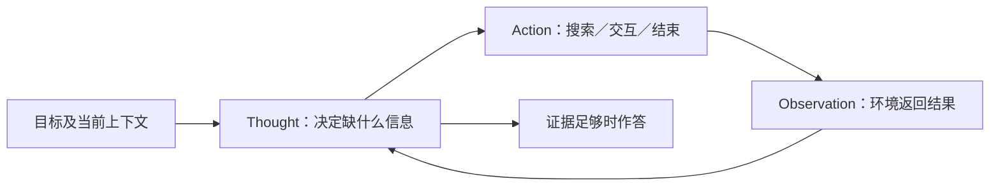
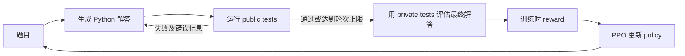

# CS329A 第 4 讲：Learning from Feedback with Tools/Code

> 课程：Stanford CS329A — Self-Improving AI Agents（2025 年秋季） 
> 主讲：Aakanksha Chowdhery（2025 年 10 月 3 日课堂；Stanford Online 于 2026 年发布视频） 
> [原视频（约 71 分钟）](https://www.youtube.com/watch?v=Lxh9RF5S-K0) · [课程官网与阅读材料](https://cs329a.stanford.edu/) 
> 本文按讲座归纳，不是逐字稿。时间戳依据视频发布者的英文 CC，并以三篇原论文核对机制与指标；未逐帧核查视频画面和音频，字幕不清的课堂发言不作确定转述。

## 一句话主线

Agent 要从行动中变好，首先得明确**反馈来自哪里、反馈能证明什么、反馈有没有进入参数更新**。本讲依次讨论：**ReAct** 在推理时交替产生 reasoning、tool action 和 environment observation；**RLEF（Reinforcement Learning from Execution Feedback）** 让代码模型读取测试失败并修复，同时以隐藏测试的结果进行强化学习；**Constitutional AI** 则在人写原则的约束下，用模型的 critique、revision 和偏好判断提供可扩展的训练信号。三者都构成闭环，但不能把“当前任务里重试成功”直接等同于“模型已学会”。[00:38](https://www.youtube.com/watch?v=Lxh9RF5S-K0&t=38s) [01:00:28](https://www.youtube.com/watch?v=Lxh9RF5S-K0&t=3628s)

| 方法 | 反馈来源 | 反馈如何发挥作用 | 本讲主要验证场景 |
| --- | --- | --- | --- |
| ReAct | 搜索 API／模拟环境返回的 observation | 原始 few-shot 方法用 observation 决定下一步；**不必更新参数** | HotpotQA、FEVER、模拟 WebShop |
| RLEF | 程序真实执行的测试结果、错误信息 | public tests 指导当前轨迹；private tests 给训练时 reward，PPO 更新参数 | CodeContests，另测 HumanEval+／MBPP+ |
| Constitutional AI | 模型依据人写 principles 生成 critique／revision 和 AI preference | 先监督微调修订答案，再训练 preference model 并做 RL | helpfulness／harmlessness 的人类偏好评估 |

## 1. ReAct：把 reasoning 与 acting 接成一个循环 [01:48](https://www.youtube.com/watch?v=Lxh9RF5S-K0&t=108s)

单独的 **chain of thought（CoT）** 只在模型已有知识和上下文中推理，可能连贯地编造事实；只执行搜索动作又缺少“下一步应查什么、查到后如何改变计划”的显式中间状态。论文《[ReAct: Synergizing Reasoning and Acting in Language Models](https://arxiv.org/abs/2210.03629)》让模型交错输出 **Thought → Action → Observation**：Thought 是语言中的计划，不改变环境；Action 调用允许的工具；Observation 由外部工具或环境返回，再加入后续上下文。[04:02](https://www.youtube.com/watch?v=Lxh9RF5S-K0&t=242s) [07:00](https://www.youtube.com/watch?v=Lxh9RF5S-K0&t=420s)

这不是先写完所有思路、再顺序执行所有动作。课堂问答明确说，**每个 observation 都可能改变下一个 thought 与 action**；搜索失败时可以改写查询。工具的 action space 也要由环境限定，例如 Wikipedia 任务的 `Search`、`Lookup`、`Finish`，否则生成任意文本不等于有效调用。[08:01](https://www.youtube.com/watch?v=Lxh9RF5S-K0&t=481s) [14:07](https://www.youtube.com/watch?v=Lxh9RF5S-K0&t=847s) [17:28](https://www.youtube.com/watch?v=Lxh9RF5S-K0&t=1048s)

讲座的 HotpotQA 示例问 Apple Remote 最初控制的软件还能由什么设备控制。ReAct 先搜索 Apple Remote，得到 **Front Row** 这个线索；第一次搜索 Front Row 不充分，便改查 Front Row software，再形成答案。示例的价值是**查询由已有观察决定**，不是说每次搜索结果都可信，也不是说模型天然知道何时该搜索。[09:43](https://www.youtube.com/watch?v=Lxh9RF5S-K0&t=583s) [10:57](https://www.youtube.com/watch?v=Lxh9RF5S-K0&t=657s) [12:28](https://www.youtube.com/watch?v=Lxh9RF5S-K0&t=748s)

### 实验读法：grounding 有用，但不是无条件胜出 [17:28](https://www.youtube.com/watch?v=Lxh9RF5S-K0&t=1048s)

- **HotpotQA** 是多跳问答，**FEVER（Fact Extraction and VERification）** 是事实核查；二者使用受限的 Wikipedia API。论文与讲座均指出 ReAct 相比 **Act-only** 更好，但纯 prompting 下**并非始终优于 CoT**：HotpotQA 上 CoT 可更强，FEVER 上 ReAct 更有利；用 **self-consistency（SC，多次采样后按答案投票）** 与 ReAct 互作 fallback 则结合了内部知识和外部检索。不能写成“ReAct 在所有问答任务必胜”。[18:01](https://www.youtube.com/watch?v=Lxh9RF5S-K0&t=1081s) [18:41](https://www.youtube.com/watch?v=Lxh9RF5S-K0&t=1121s) [论文结果](https://arxiv.org/html/2210.03629)
- **WebShop** 是模拟网页购物环境，不是论文让 Agent 在真实电商网站付款。讲座展示的 WebShop score 中，ReAct 为 `66.6`、human expert 为 `82.1`；score 与最终任务 **success rate** 不能混用。原论文另外报告 ALFWorld 和 WebShop 的 success-rate 改进，分别是相对当时基线的 **34 与 10 个百分点**，不是“模型达到 34%／10%”。[20:27](https://www.youtube.com/watch?v=Lxh9RF5S-K0&t=1227s) [21:07](https://www.youtube.com/watch?v=Lxh9RF5S-K0&t=1267s) [论文摘要](https://arxiv.org/abs/2210.03629)
- 轨迹更容易供人查看，不意味着 reasoning trace 必然忠实解释内部计算。错误检索、相互矛盾的来源、多步误差传播、庞大 action space 所需的示例，以及多次调用的 latency／token cost 都仍是限制；讲师把验证冲突来源和 backtracking 作为课堂讨论，而非论文已解决的保证。[19:38](https://www.youtube.com/watch?v=Lxh9RF5S-K0&t=1178s) [22:10](https://www.youtube.com/watch?v=Lxh9RF5S-K0&t=1330s) [23:15](https://www.youtube.com/watch?v=Lxh9RF5S-K0&t=1395s)

**关键区分**：本讲重点演示的是 frozen model 的 few-shot ReAct prompting，成功来自**当前上下文中利用外部 observation**；论文还研究了 fine-tuning，但不能把原始 prompting 的收益说成在线训练后的参数改进。[09:05](https://www.youtube.com/watch?v=Lxh9RF5S-K0&t=545s) [20:15](https://www.youtube.com/watch?v=Lxh9RF5S-K0&t=1215s)

## 2. RLEF：让代码模型学会使用 execution feedback [27:31](https://www.youtube.com/watch?v=Lxh9RF5S-K0&t=1651s)

《[RLEF: Grounding Code LLMs in Execution Feedback with Reinforcement Learning](https://arxiv.org/abs/2410.02089)》研究的不是“多生成几份代码然后挑一份”，而是在自然语言编程题中**多轮修复同一解答**：代码是 action；运行 public tests 产生 passed/failed cases、syntax/runtime error 等 observation；模型看完反馈再改代码。讲座的回文子串示例中，初版运行超时，下一轮修改后通过公开测试。[28:37](https://www.youtube.com/watch?v=Lxh9RF5S-K0&t=1717s) [30:44](https://www.youtube.com/watch?v=Lxh9RF5S-K0&t=1844s)

图中有**两个时间尺度**。内环在一次 rollout／推理中读取公开测试并修复，参数可以保持不变；外环在训练时用隐藏测试确定最终解答的 reward，以 **proximal policy optimization（PPO）** 改变 policy。即使公开测试通过，隐藏测试仍可能失败；达到 turn limit 也会提交最终版本作评估。公开测试与隐藏测试的分离既减少每轮运行开销，也防止模型仅凭可见样例输出投机取巧。**Private tests 在训练时用于 reward，并非永远不参与训练；在当前生成轨迹中它们对 policy 不可见**。[29:25](https://www.youtube.com/watch?v=Lxh9RF5S-K0&t=1765s) [31:33](https://www.youtube.com/watch?v=Lxh9RF5S-K0&t=1893s) [论文方法](https://arxiv.org/html/2410.02089)

论文的最终正确性 reward 是离散的：终局全过测试给正奖励，失败给负奖励；还对无效代码施加小惩罚，并加入相对初始 policy 的 KL regularization。因此课堂说“binary reward”抓住了主要正确性信号，**不代表完整 PPO objective 只含一个 0/1 位**。实现上 policy 按 token 生成，value function 按整个 turn 估值，同一回复中的 tokens 共用 turn-level advantage；这处理了“每个 token 都是动作”和“测试在整段代码后才有意义”的粒度不匹配。[28:49](https://www.youtube.com/watch?v=Lxh9RF5S-K0&t=1729s) [32:17](https://www.youtube.com/watch?v=Lxh9RF5S-K0&t=1937s) [论文 §2.2](https://arxiv.org/html/2410.02089)

### 结果要同时说明样本预算和选答口径 [35:22](https://www.youtube.com/watch?v=Lxh9RF5S-K0&t=2122s)

论文在 **CodeContests** 的 Llama 3.1 Instruct 实验中，`1@3` 表示总共最多 **3 个模型回复／一个三轮 rollout**，问最终是否有一个正确解；不是单次直接输出的 pass@1。测试集的 8B 模型从 `10.5 → 16.0`，70B 模型从 `27.5 → 40.1`（均为论文的 average solve rate，百分比口径）。更大预算 `10@100` 表示总共 100 个回复中选 10 个解答、期望至少一个正确，其数值不可直接当成用户最终收到一个答案的正确率。[论文 §3.1–3.2 与 Table 1](https://arxiv.org/html/2410.02089) 课堂对 `10@k` 的即时口头解释不够精确，此处采用论文定义。[35:55](https://www.youtube.com/watch?v=Lxh9RF5S-K0&t=2155s)

固定 3 次生成的单轮／多轮比较尤其有说明力：未训练的模型在收到失败代码和反馈后，并不总能比独立重采样更好；RLEF 训练后多轮修复才明显受益。论文还把真实反馈换成**另一题的随机错误反馈**，修复能力显著受损，支持模型确实在利用反馈，而不只是多抽样；在 HumanEval+／MBPP+ 上也观察到一定迁移。不过较少的 wrong output 可伴随更多 timeout，不能说所有错误类别一起下降。[36:17](https://www.youtube.com/watch?v=Lxh9RF5S-K0&t=2177s) [37:09](https://www.youtube.com/watch?v=Lxh9RF5S-K0&t=2229s) [论文 §3.3](https://arxiv.org/html/2410.02089)

**边界**：实验主要处理有测试用例的单道竞争编程题，不等于在任意大型仓库中完成需求分析、定位文件与跨模块修改。课堂把搜索代码库、摘要、SWE-bench 等作为迁移讨论；这些不是 RLEF 本身在该实验中已经解决的任务。测试缺失、覆盖不足、reward hacking、沙箱运行成本以及更长任务的 decomposition 都仍需额外设计。[43:38](https://www.youtube.com/watch?v=Lxh9RF5S-K0&t=2618s) [44:18](https://www.youtube.com/watch?v=Lxh9RF5S-K0&t=2658s) [论文局限](https://arxiv.org/html/2410.02089)

## 3. Constitutional AI：原则指导的 AI feedback [46:30](https://www.youtube.com/watch?v=Lxh9RF5S-K0&t=2790s)

当目标是助手的 **helpfulness** 与 **harmlessness**，不像代码那样总有可运行的正确性测试。RLHF（reinforcement learning from human feedback）常以人类偏好训练 reward／preference model，但大规模逐条标注耗时。《[Constitutional AI: Harmlessness from AI Feedback](https://arxiv.org/abs/2212.08073)》让人先写一组自然语言 **principles（constitution）**，再借模型生成更多监督信号。论文实验用到 16 条原则；原则由人设定，所谓“AI feedback”并非价值标准凭空由模型产生。[46:50](https://www.youtube.com/watch?v=Lxh9RF5S-K0&t=2810s) [48:00](https://www.youtube.com/watch?v=Lxh9RF5S-K0&t=2880s)

### 两个训练阶段 [48:42](https://www.youtube.com/watch?v=Lxh9RF5S-K0&t=2922s)

1. **Supervised learning（SL）**：取 red-teaming prompt 和初始回答，按一条原则请求模型 critique（指出潜在有害或偏见之处），再请求 revision（重写为更符合原则的答复）；以**修订后的回答**作为主要监督目标微调初始模型。课堂举了有害内容、性别偏见和儿童适宜性三类原则示意；并非把原始有害回答直接强化。[49:34](https://www.youtube.com/watch?v=Lxh9RF5S-K0&t=2974s) [50:43](https://www.youtube.com/watch?v=Lxh9RF5S-K0&t=3043s) [论文摘要](https://arxiv.org/html/2212.08073)
2. **RL from AI feedback（RLAIF）**：从已微调模型采样成对回答，让另一个模型依据 principles 比较哪一个更可取，汇集 AI preference 来训练 **preference model**；再用该模型的分数作 reward，强化学习更新助手。**Critique／revision 是监督数据生成，偏好比较／reward 才是 RL 阶段**，不能合并为一次“模型自评即在线修改”。[49:20](https://www.youtube.com/watch?v=Lxh9RF5S-K0&t=2960s) [51:44](https://www.youtube.com/watch?v=Lxh9RF5S-K0&t=3104s) [论文方法](https://arxiv.org/html/2212.08073)

论文用人类比较产生的 **Elo** 衡量 helpfulness 和 harmlessness；Elo 是相对偏好尺度，不能读作“安全事件减少了某个百分比”。其实验中的 RL-CAI 在给定 helpfulness 水平下可获得更好的 harmlessness 偏好，同时希望避免对有害请求一概回避、转而解释拒绝理由。讲座也讨论两目标的 trade-off：一味增加拒绝或修订轮次可能伤及有益请求的 helpfulness。不要将课堂口误“less harmless”理解为论文希望模型更有害，也不要将某一条曲线推广为所有规范目标都能保持同样的 Pareto 改善。[51:10](https://www.youtube.com/watch?v=Lxh9RF5S-K0&t=3070s) [53:49](https://www.youtube.com/watch?v=Lxh9RF5S-K0&t=3229s) [58:26](https://www.youtube.com/watch?v=Lxh9RF5S-K0&t=3506s) [论文 Fig. 2](https://arxiv.org/html/2212.08073)

**AI judge 不是可执行 verifier**：原则的选择、模型是否正确识别伤害、偏好模型是否偏向表面措辞，都须另外审查。该论文没有使用人类的**有害性训练标签**，但原则来自人，且结果仍通过人类偏好评价；“完全不需要人”是错误表述。课堂问答提出人工 validation、原则更改后的持续学习与遗忘旧规则问题，讲师将后者视为开放研究问题，并未保证规则更新会彻底覆盖旧行为。[52:21](https://www.youtube.com/watch?v=Lxh9RF5S-K0&t=3141s) [57:34](https://www.youtube.com/watch?v=Lxh9RF5S-K0&t=3454s) [论文摘要](https://arxiv.org/html/2212.08073)

## 4. 三种闭环如何拼成 Agent，但哪里不能类比？[01:00:28](https://www.youtube.com/watch?v=Lxh9RF5S-K0&t=3628s)

ReAct 解决“**现在该查什么、观察后如何改下一步**”；RLEF 解决“**如何让模型经过训练学会利用可执行反馈**”；Constitutional AI 解决“**缺少简单真值时如何用明示原则规模化偏好监督**”。它们可作为 Agent 的不同模块，但反馈的可靠性不等价：检索结果可能错，测试只能覆盖被编写的用例，AI judge 也会延续原则和自身的盲点。真正部署时应分别报告任务成功率、调用／采样成本、反馈来源和是否更新参数，而不能统称“self-improvement”。[01:01:44](https://www.youtube.com/watch?v=Lxh9RF5S-K0&t=3704s) [01:02:30](https://www.youtube.com/watch?v=Lxh9RF5S-K0&t=3750s)

课堂结尾指出，ReAct 的 workflow 与 action space 对具体 domain 很敏感；更强的 RL post-training 可能学习部分工具行为，但尚不意味着各行业任务的搜索空间与停止条件会自动被定义好。大型代码库的检索、长程任务的 memory 与 decomposition，都是从本讲的短闭环走向更完整 Agent 的后续问题。[01:05:57](https://www.youtube.com/watch?v=Lxh9RF5S-K0&t=3957s) [01:07:01](https://www.youtube.com/watch?v=Lxh9RF5S-K0&t=4021s)

## 复习时回答这 5 个问题

1. ReAct 的 Thought、Action、Observation 各由谁产生？为什么 observation 可能改变下一次查询？
2. HotpotQA 中 ReAct 相比 Act-only 与 CoT 的结论为何不同？何时需要 fallback 或再验证来源？
3. RLEF 的 public tests 与 private tests 分别参与推理和训练的哪个环节？`1@3` 为什么不是 pass@1？
4. 随机错误反馈的消融能排除哪些解释，又不能证明模型具备哪些大型软件工程能力？
5. Constitutional AI 的 SL 和 RL 阶段各用什么数据？它的 AI preference 与可执行测试在可靠性上有什么差异？

## 资料与核对

- [Stanford Online 原讲座视频与发布者英文 CC](https://www.youtube.com/watch?v=Lxh9RF5S-K0)：时间戳依据视频 ID `Lxh9RF5S-K0` 的 `English - CC (English)` VTT；字幕可有听辨和说话人误差。
- [Stanford CS329A 课程官网（Autumn 2025）](https://cs329a.stanford.edu/)：核对讲次、日期、主讲人与三篇指定阅读。该学期 Homework 1 于 10 月 3 日布置，属历史课程安排，不作为当前截止日期。
- [ReAct 原论文](https://arxiv.org/abs/2210.03629)：核对任务、对照组、WebShop 与 ALFWorld 结论。
- [RLEF 原论文](https://arxiv.org/abs/2410.02089)：核对 public/private tests、PPO reward、`n@k` 定义、CodeContests 数字与局限。
- [Constitutional AI 原论文](https://arxiv.org/abs/2212.08073)：核对 supervised/RLAIF 两阶段、原则来源与人类评估口径。
